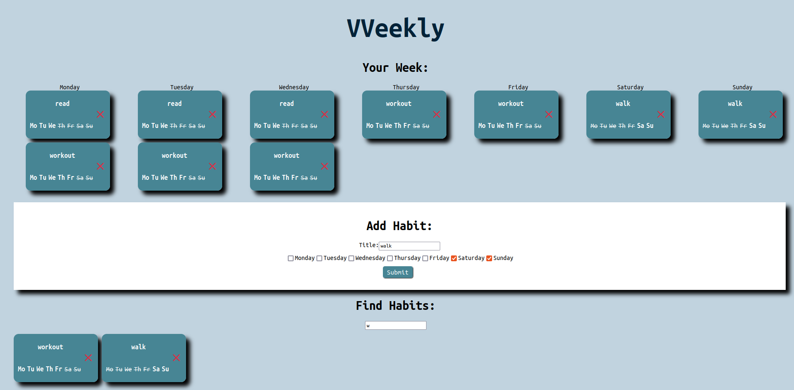

# VVeekly Habits Tracker

This project is a full-stack application designed to help users track their daily habits. It utilizes a Django REST framework backend and a React frontend with Vite for an efficient development experience.

## Description

VVeekly Habits Tracker allows users to create, update, and monitor their daily habits. It features a modern, responsive UI and a secure, scalable backend. The project is structured into a `frontend` directory for the React application and a `backend` directory for the Django REST API.

